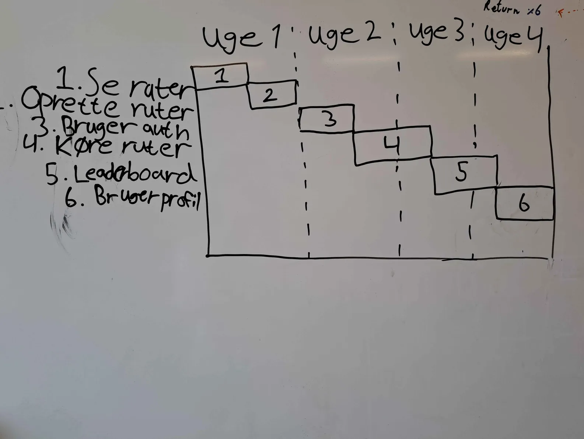

# Avarts

## Case beskrivelse

Pim de Keysergracht's Snel Gaan VOF vil gerne fremme racersport da de sælger
grej til adskillige racersportsgrene. Derfor vil de gerne have en løsning.

For at øge engagement i deres sportsgrene vil de gerne have en måde hvor brugere
nemt kan måle tid og konkurrere, uden at skulle holde et formelt tourné.

Virksomheden vil have at brugere kan måle og sammenligne, sine præstationer med
andre inden for sin racersport. Virksomheden vil have at brugere kan oprette
ruter som brugeren og andre brugere kan køre ræs på.

## Kravspecifikation

Som kunde skal løsningen:

- kunne bruges på en telefon
- kunne oprette og håndtere en brugerprofil
- kunne oprette ruter
- kunne søge/se eksisterende ruter
- kunne køre et ræs på en rute
- kunne sammenligne sit ræs med sine tidligere ræs
- kunne sammenligne sine ræs med andres ræs
- kunne skelne mellem forskellige transportmidler

## Tidsplan

- Se ruter
- Oprette ruter
- Bruger authentikation
- Køre ruter
- Leaderboard per rute per sportsgren
- Brugerprofil

### Uge 1

Efter uge 1 forventer vi at kunne se ruter og oprette en rute.

### Uge 2

Efter uge 2 har vi bruger auth og er i gang med at implementere at kunne køre
ruter.

### Uge 3

Efter uge 3 kan man køre ruter og er i gang med at implementere leaderboard

### Uge 4

Efter uge 4 har vi leaderboard implementeret og brugerprofil
