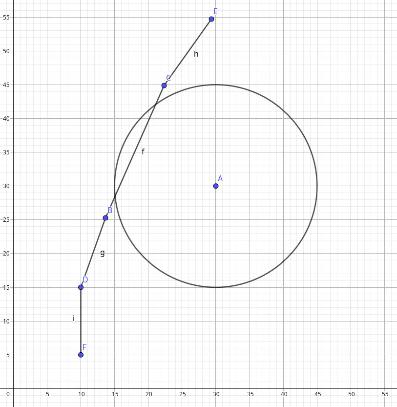
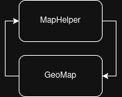
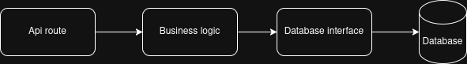
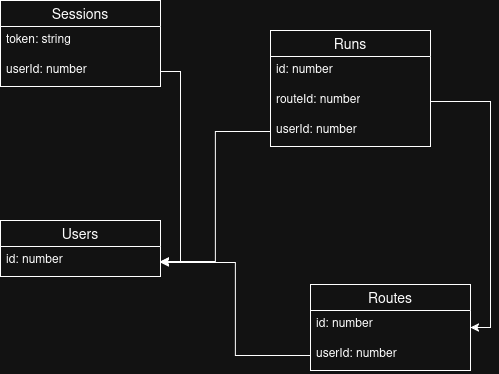

# Avarts

_Mikkel Kongsted &lt;mtkongsted@gmail.com&gt;, Theis Pieter Hollebeek
&lt;tphollebeek@gmail.com&gt; - 26.5.2026_

Avarts er en web-app, hvor en bruger kan oprette og køre ruter. Brugeren kan
konkurrere med andre brugere med sit eget transportmiddel ved at kæmpe om den
bedste tid på en given rute indenfor det transportmiddel.

Løsningen består af en web-app med et verdenskort og en backend server der
kommunikere over HTTP sammen med web-appen. Udover det har vi også en shared
mappe der beskriver typer og funktioner både backend server og web-appen bruger.

Projektet er deploy'et på domænet https://avarts.tpho.dk.

Koden og andre relevante materialer ligger på [vores Github repository]

[vores Github repository]: https://github.com/mtkonge/avarts

## Typescript

Hele vores projekt er skrevet i Typescript. Vi har valgt at skrive alting i
Typescript, da vi har meget erfaring i det, og kan dele kode som datastrukturer
mellem app og backend.

Typescript kan både transpiles til browser Javascript, og til native Javascript.

Browser Javascript køres med brugeren's browser's Javascript runtime, dette er i
kontrast til native Javascript, som kører vha. en native javascript runtime. Vi
har valgt Deno som vores native runtime. Vi har derudover også skrevet vores
build scripts, som har ansvaret for at transpile vores webapp til browser
javascript, i Deno, da det betyder at vi ikke behøver at bruge både Deno og
Node, som var den eneste (viable) runtime, før at Deno blev lavet.

Vi har valgt Typescript frem for Javascript, da vi har vurderet, at muligheden,
til at statisk garantere at størstedelen af vores software er korrekt, sparer os
nok tid, til at det er den ekstra tidsinvestering værd.

Da Typescript kun eksisterer som et lag ovenpå Javascript, som ikke eksisterer i
runtime, kan vi ikke garantere at ukendt data, f.eks. data læst fra filer, eller
hentet over netværket, er korrekt. Der er derudover begrænsninger på
Typescript's type system.

For at overkomme dette, har vi suppleret med librariet `zod`. Zod tilbyder
runtime validering af data, og understøtter Typescript.

## Zod

Applikationen tager stor brug af Javascript librariet `zod`. Zod gør det muligt
at definere schemas, som man derefter kan bruge til at parse ukendt data. Vi har
brugt det til at validere alt fra requests og responses, til json data vi læser
fra filer. Da Typescript kun eksisterer i compile time, og der ikke findes
statiske typer i Javascript, hjælper det os med at garantere at alt dynamisk
ukendt data, der kommer i runtime, hvor Typescript ikke kan garantere noget,
faktisk er det data, som vi tror det er.

Zod tillader dig derudover at få en Typescript type der beskriver dit schema, ud
fra det schema du har defineret, som betyder at det spiller perfekt sammen med
vores brug af Typescript.

Vi har valgt at bruge dette library, da vi havde tidligere erfaring med det, og
at være sikker på at vi har den rigtige struktur, sparer os, ligesom Typescript,
tid i længden, efter en upfront tidsinvestering. Vi har vurderet at denne
tidsinvestering er langt mindre, end det gavn vi får fra det.

## Results

Til error handling har vi, frem for at bruge exceptions og try/catch, taget
inspiration fra funktionelle sprog og deres Result type.

Det er implementeret som en tagged union med en værdi, eller en fejl. Altså:

```ts
type Ok<T> = { ok: true; value: T };
type Err<E> = { ok: false; error: E };
type Result<T, E> = Ok<T> | Err<E>;
```

Det har vi gjort pga. det har et par goder, som exceptions ikke har.

Det er muligt at se hvilke fejl, en funktion kan returnere, ud fra dens
signatur. Sammenlign de følgende funktionssignaturer:

```ts
function read_file_a(): string;

function read_file_b(): Result<string, string>;
```

Man kan i `read_file_a` ikke se, at den kaster en fejl. Derudover, kan man ikke
se hvornår den **ikke** kaster en fejl. Det betyder, at man kan håndtere
exceptionen fra en funktion, alá dette:

```ts
try {
    read_file();
} catch {
    console.error("could not read file");
}
```

Men hvis man senere hen refactorer `read_file_exception` til, at ikke kaste
exceptions, er der intet der kan advare dig, om at du har et unødvendigt
try-catch.

Derudover, skaber det også trælse træer med meget indentation, og betyder man
skal læse koden "op-ned-op-ned-op-ned" (try, catch, try, catch, try, catch) som
er unnaturligt, og i længere filer i praksis gør, at det er sværre at finde ud
af, hvilken catch block der tilhører hvilken try block.

```ts
try {
    const file = read_file();
    try {
        const parsed = parse_file(file);
        try {
            /* etc. */
        } catch {
            /* etc. */
        }
    } catch {
        console.error("could not parse file");
    }
} catch {
    console.error("could not read file");
}
```

Dette er taget til kontrast med Result typen. Vi kan med Typescript's type
system garantere, at man håndterer fejlen.

```ts
const file_result = read_file();

// err: member `value` does not exist on type `{ ok: true, value: string } | { ok: false, error: string }`
const file_data = file_result.value;

if (!file_result.ok) {
    console.error(`could not read file: ${file_result.error}`);
    return;
}

// fordi vi har `return`'ed når file_result.ok === false, kan Typescript's type system vide,
// at file_result kun kan være en `Ok<string>`, og vi kan derfor få adgang til dens værdi.

const file_data = file_result.value;
/* etc. */
```

Og hvis vi nu refactorer read_file, så den ikke kan fejle, kan typescript
fortælle os, at vi tjekker for fejl, der ikke kan ske:

```ts
const file_result = read_file();

// err: member `ok` does not exist on type `string`
if (!file_result.ok) {
    // err: member `error` does not exist on type `string`
    console.error(`could not read file: ${file_result.error}`);
    return;
}

// err: member `value` does not exist on type `string`
const file_data = file_result.value;
/* etc. */
```

Derudover løser det også vores problem med mange indents, og at error handling
kode ikke ligger tæt på, der hvor den fejlende funktion ligger:

```ts
const file = read_file();
if (!file.ok) {
    console.error("could not read file");
    return;
}
const parsed = parse_file(file.value);
if (!parsed.ok) {
    console.error("could not parse file");
    return;
}
```

Vi har i stedet reserveret Exceptions til brug som en `panic` funktionalitet,
dvs. fejl i softwaren, hvor at vores antagelser er forkert. Eksempelvist:

```ts
const mapElement = document.querySelector("#map");
if (mapElement === null) {
    throw new Error(
        "unreachable: index.html does not have an element with an id of #map",
    );
}
```

## Web-appen

Web-appen er implementeret med HTML, CSS og Typescript. Vi har brugt Deno som
Typescript/Javascript runtime og bruger vores egne scripts, der bruger esbuild
til at bygge appen. Vi har brugt maplibre-gl til verdenskortet.

Vi har valgt Typescript da vi har meget erfaring i det, og det nemt kan
transpiles til det Javascript, som HTML dokumenter bruger. Vi har valgt
Typescript i stedet for Javascript, da vi så kan statisk garantere at vores
kodes typer er korrekte. Vi synes, at det tid vi sparer med fejlfinding med
Typescript, gør den upfront tidsinvestering det værd.

Vi har valgt at bruge Deno, da vi vurdere, at det er et bedre alternativ til
Node. Vi mener at måden Deno håndtere dependencies på, er mere intuitiv end
måden Node gør det.

Vi har valgt at bygge vores egne scripts med esbuild, da det giver os mere
frihed. Vi startede med at bruge Vite, men dette fandt vi ud af gav problemer,
når man brugte et monorepo setup med deno workspaces. I det at vi begyndte at
bruge shared mappen til deling af typer og funktioner til både backenden og
appen, skiftede vi til vores egne scripts. Vi har brugt disse scripts i andre
projekter før, så det har derfor været nemt at skifte til dem.

Vi bruger Deno til at køre vores build scripts, som vha. af et plugin, gør at vi
kan få dependency management, som vi kender det fra Deno, men transpileret til
browser-kompatibel Javascript.

Vi har valgt at bruge maplibre-gl med openstreetmaps som datakilde. Det har vi
gjort for at undgå at bøvle med api nøgler og betaling af licens, som vi skulle,
hvis vi byggede ovenpå f.eks. google maps' api.

Det har alt, som vi ellers vil have i en kort library, som f.eks. inkluderede
typescript typer, rotation, at tegne ruter, m.m.

### Oprettelse af rute

Man kan oprette en rute ved at trykke på "Opret rute" knappen ("Create route") i
toolbar'en øverst på siden.

Derefter begynder vi vha. browseren's geolocation at mappe hvilken rute brugeren
har taget. Det tegner vi som en linje bag brugeren.

Når brugeren er færdig, kan brugeren trykke på knappen "Færdiggør rute" ("Finish
route"), som ligger, der hvor den tidligere Opret rute knap ligger. Brugeren
bliver derefter spurgt om at navngive ruten, hvorefter den bliver send til
backenden og oprettet i databasen.

Brugeren får så hentet alle de nyeste ruter, inklusiv deres egen, og de bliver
tegnet på kortet.

### Kørelsen af et 'run'

Når en bruger kører et run skal man have en måde at verificere om brugeren har
kørt ruten korrekt. Måden vi er endt med at gøre dette på er ved give en radius
til alle checkpoints i ruten. Denne radius skal brugeren så køre igennem for at
opnå checkpoint'et.

Måden vi beregner om brugeren har kørt korrekt igennem checkpoints er ved at for
hver koordinat brugeren har kørt, kan vi definere en linje mellem det koordinat,
og det koordinat, der blev målt før det.

Vi har derefter et linjestykke. Vi kan så finde det punkt på linjestykket, der
ligger tættest på checkpointet. Nu hvor vi har 2 punkter, kan vi finde distancen
mellem de to vha. pythagoras, og hvis distancen er <= radius, har brugeren fået
det checkpoint. Vi går derefter videre til næste checkpoint.

Hvis distancen > radius, går vi i stedet videre til næste koordinat, og dermed
næste linjestykke, indtil vi enten løber tør for linjestykker, eller løber tør
for checkpoints.

Grunden til at vi gør det som linjestykker i stedet for punkter, kan man se på
billedet nedenfor. Her kan man se, at brugeren har kørt i yderkanten af et
checkpoint. Her er der ingen punkter, der er inde for den checkpointets radius,
så selvom man kan se, at linjen går indover checkpointet, ville man altså ikke
få checkpointet.



En af de første problemer vi stod på, da vi skulle lave disse beregninger var,
at de meter som checkpoints radius skulle være, skulle oversættet til kortets
longitude og latitude. Siden jorden er rund<sup>[citation needed]</sup>, og
kortet er en flad projektion, skaber det visse udfordringer.

Jo længere væk af latitude (nord/syd) man kommer fra ækvator jo mindre longitude
(vest/øst) skal vi bruge for at opnå samme antal meter.

Dette betyder altså at vores radius kan dynamisk ændre alt efter hvor det er på
kloden. Vi har valgt ikke at gøre det store ud af dette. Den måde vi konvertere
meterne af til longitude og latitude, er ved at antage, at vi er ved ækvator. Vi
konvertere det altså til latitude som er en konstant. Checkpoints vil derfor
være ovaler med undtagelsen hvis checkpointet ligger i ækvator, hvor det vil
være en perfekt cirkel.

Vi har valgt at gå på kompromi med nøjagtighed, da vi vurderede at
tidsinvesteringen ikke var det værd. Hvis vi havde mere tid, ville det være
muligt at beregne `x` meters størrelse som funktion af latitude, og bruge det
til at beregne checkpoint radiusen på x aksen. Dog vil det stadig betyde at
vores checkpoints er oval, forskellen på den 1. og 2. radius er bare så lille,
at man ikke kan se det. Man kan godt lave perfekte cirkler på kortet, men dette
kræver meget mere computerkraft, da man skal beregne hver pixel i cirklens
omkreds, som vi har vurderet til at være kæmpe spild af tid og ressourcer.

Når man starter et run, bliver ruten markeret med mørkeblå, hvor derefter når
man når de forskellige checkpoints i ruten, vil den del af ruten du har kørt
blive markeret med blåt. Man kan derfor se, hvis man er kommet til at undvige et
checkpoint i løbet af sit run.

I starten da vi lavede vores kode til verificering af et run, valgte vi en
radius på cirka 5 meter. Efter at have været ude at teste det, fandt vi ud af,
at den geolocationsdata vi fik var mere ustabil end forventet. Nogle gange kunne
geolocationsdataen godt være en 2-5 meter væk fra vores korrekte location.

Det betød, at i de fleste tilfælle ville man misse et checkpoint på grund af
dette. Efter vi havde testet det, ændrede vi det til cirka 15 meter. Dette
virker bedre, men man kan godt indimellem opleve at locationsdataen er så
ukorrekt at man stadig ikke når de checkpoints, man burde have kørt igennem,
hvis dataen var mere præcis.

Vi har vurderet, at 15 meter er godt nok. Vi vil gerne undgå at ruternes
checkpoints er urealistiske, altså at man rammer et checkpoint selvom man er
utroligt langt væk fra det, men samtidig vil vi også gerne undgå, at brugeren
føler sig snydt, fordi geolocationsdataen var for dårlig.

### Leaderboard og profil

Hvis man vælger en rute ved at trykke på den, kan man vha. "Leaderboard"
knappen, der viser sig, se leaderboardet for den rute.

Den viser en liste af 'runs' sorteret efter, hvor lang tid de tog om at klare
ruten.

Hvis der er mere end én sportsgren brugt på den rute, f.eks. "Cykel" og
"Skateboard", får brugeren muligheden for at filtrere efter sportsgren.

Rankering er baseret på filtreringen af sportsgrenene. F.eks. hvis du har valgt
at ikke filtrere, kan en bruger i bil være nr. 1 og en bruger på cykel som nr 2.
Hvis du har filtreret efter sportsgren, viser den kun placeringen i den
sportsgren, f.eks. cyklen der før var #2, er nu #1.

Run'sne inkluderer transportmiddel og brugeren. Hvis man klikker på brugerens
navn, bliver man bragt til den brugers profil.

Man kan komme til sin egen profil ved at trykke på "Min profil" ("My profile")
knappen i toolbaren øverst.

Profilen viser hhv. hurtigste runs, og run'sne der skete for nyligt. Run'sne
inkluderer hvor brugeren er placeret på leaderboardet.

### Forbindelsen til backend serveren

Vi har valgt at lave alt kontakt til backenden gennem interfaces, som betyder,
at vi evt. kan lave appen offline, eller lave in-memory mock servers til
automatiseret testing.

Det fungerer som 2 interfaces, en `UnauthorizedServer`, og en
`AuthorizedServer`. De ser sådan ud:

```ts
export interface UnauthorizedServer {
    userFromId(
        request: UserFromIdRequest,
    ): Promise<Result<UserWithId, string>>;
    runsOnRoute(
        request: RunsOnRouteRequest,
    ): Promise<Result<RunWithUserIdAndId[], string>>;
    routes(): Promise<Result<RouteWithUserIdAndId[], string>>;
    route(request: RouteRequest): Promise<Result<RouteWithUserIdAndId, string>>;
    register(
        request: RegisterRequest,
    ): Promise<Result<void, string>>;
    login(
        request: LoginRequest,
    ): Promise<Result<string, string>>;
}

export interface AuthorizedServer extends UnauthorizedServer {
    addRoute(
        request: Omit<AddRouteRequest, "token">,
    ): Promise<Result<void, string>>;
    deleteRoute(
        request: Omit<DeleteRouteRequest, "token">,
    ): Promise<Result<void, string>>;
    logout(
        request: Omit<LogoutRequest, "token">,
    ): Promise<Result<void, string>>;
    user(
        request: Omit<UserRequest, "token">,
    ): Promise<Result<UserWithId | null, string>>;
    addRun(
        request: Omit<AddRunRequest, "token">,
    ): Promise<Result<void, string>>;
}
```

Vores `UnauthorizedServer` håndterer de requests, der ikke kræver user
validation, mens vores `AuthorizedServer` har de requests, der kræver user
validation.

Vi genbruger de zod schemaer, som vi bruger til at parse requests på serveren,
til at sende requests på frontenden. På `AuthorizedServer` efterbehandler vi så
de typer, ved at fjerne `token` feltet, da det er en `AuthorizedServer`'s ansvar
at håndtere user validation.

Det har vi gjort sammen med, at man kun kan skabe en `AuthorizedServer` med en
valid token i constructoren. Det betyder så, at vi ikke kan kalde
`AuthorizedServer`'s funktioner uden at have en user med en valid token, dvs. at
vi undgår at en request fejler, fordi den har en invalid token.

Det ser sådan ud, i praksis:

```ts
export async function authorizedServer(): Promise<AuthorizedServer> {
    const token = localStorage.getItem("token");
    if (token === null) {
        return await redirectToLogin();
    }
    const server = new AuthorizedHttpServer(url(), token);
    const user = await server.user({});
    if (!user.ok || user.ok && user.data === null) {
        return await redirectToLogin();
    }
    return server;
}
```

Det betyder, at hvis vi er på en side, der kræver authentication, kan vi skrive:

```ts
const server = await authorizedServer();
await server.addRun(/* ... */);
```

Og så ved vi, at vi altid har en gyldig authorized server.

### Dependency resolution ved abstraktioner

Vi har valgt at overholde principet Seperation of Concerns. Det betyder at vi
gerne vil sørge for at hver individuelle element kun har et ansvar. Nogle gange
kan der opstår vanskeligheder, når man gør dette. Her er et eksempel på en
abstaktion der skabte en circular dependency.

Vi har lavet en abstraktion over `maplibregl`, som vi har kaldet `MapHelper`.
Det har vi gjort, pga. at maplibregl har en meget verbose syntax, og vi ikke
glad at blande maplibregl specifikt funktionalitet (tegne linjer på kortet,
etc), sammen med vores `GeoMap` konstrukt.

Vores `GeoMap` klasse styrer logic skrevet specifikt til vores app. Det vil
sige, hvad der skal ske når man f.eks. starter et run. Denne klasse bruger
`MapHelper` til at oprette og tegne på kortet.

Grundet at kortet skal være interaktivt, ved at man klikker på ruter for at
kunne se leaderboard og at køre på en rute, skal `MapHelper` oprette event
listeners, som kalder funktionalitet som `GeoMap` har.

Det betyder lige nu, at `GeoMap` kræver `MapHelper`, og vice versa:



Dette kalder man også en circular dependency. Problemet med circular
dependencies er, at de er umulige at resolve. Vi har derfor i stedet givet
`MapHelper` nogle late callbacks. Dvs, vi opretter `MapHelper` uden den krævede
dependency til `GeoMap`, som vi så bruger til at oprette `GeoMap`, og derefter
kan vi sætte medlemmerne til en callback, der referrerer til `GeoMap`.

Hvis vi skulle gøre det om igen, ville vi lave denne abstraktion anderledes, da
det blev meget mudret, hvad der er `GeoMap`'s ansvar, og hvad der er
`MapHelper`'s ansvar, da de arbejder meget tæt sammen.

Man kunne i stedet for late functions, når ruter tegnes, returnere en liste af
`MapLine`s, én for hver rute, som `GeoMap` kunne tilføje event listeners til,
osv.

Eksempelvist:

```ts
class MapLine {
    constructor(private owner: MapHelper, id: number) {}

    on(type: "click", callback: () => void) {
        this.owner.findLineWith(id).on("click", () => {
            callback();
        });
    }
}
```

## Backend server

<p align="center">
  
</p>

Backend serveren er også skrevet skrevet i Typescript med Deno. Her kører vi
Typescript filerne direkte med Deno. Vi bruger Oak til at håndtere vores http
requests og middleware. Til kryptering af passwords bruger vi bcrypt. Vores
database er implementeret ved at gemme objekterne i json filer på harddisken.

Vi har valgt at bruge Oak, da vi har tidligere erfaring med det, og det er den
mest populære måde at lave servere i Deno på, som betyder, at der er mange
ressourcer og libraries.

Vi har brugt bcrypt, da det er et populært værktøj til kryptering. Det er
vigtigt at man vælger krypteringsværktøjer, man kan stole på, og da bcrypt er en
industri-standard for kryptering, og det er den, vi har mest erfaring med,
vurderer vi, at det er den bedste at bruge til at løse vores problem.

### Business logic

Vi har valgt at følge princippet Seperation of Concerns, og afkoble vores
business logic, fra vores http api.

Vores business logic er implementeret som funktioner, der modtager relevant data
og et interface til Database og Sessions, der returnerer et resultat. Det
betyder, at vi ikke håndterer api'ens problemer i vores business logic, og
business logic problemer i vores api, som gør det nemmere at overskue.

Det gør det også nemmere at evt. teste, da vi nu kan lave unit tests på vores
business logic, frem for at være tvunget til at lave end-to-end tests.

Her er et eksempel.

```ts
// server/src/business_logic
type UserWithIdError = "bad_user" | "db_error";

export async function userWithId(
    request: { id: number },
    database: Database,
): Promise<Result<{ user: UserWithId }, UserWithIdError>> {
    // ...
}
```

Dette er vores business logic for ruten "/user-from-id". Her kan vi lave kald
mod databasen, for at få det data vi har brug for. Vi sørger for at returnere
beskrivelser af de fejl, der nu må opstå. Her kan vi se, at fejlende kan være
enten 'bad_user' eller 'db_error'. Dette kan vi parse, når vi bruger metoden i
vores ruter.

```ts
// server/src/api/user
router.post(
    "/user-from-id",
    parse(
        UserFromIdRequest,
        UserFromIdResponse,
        async (req): Pmr<UserFromIdResponse> => {
            const result = await businessLogic.userWithId(
                req,
                database,
            );
            // ...
        },
    ),
);
```

Dette er vores rute, der bruge vores business logic metode `userWithId` som
beskrevet overfor. Vi bruger ikke databasen i selve rute implementationen, det
er business logic'en ansvarlig for. Det følger vores praksis af, at ruterne
eksisterer som et interface, og dens ansvar er at følge vores api spec, og
omdanne det til noget business logic'en kan bruge.

Business logic'en derimod, ved ikke om den kører på en Oak, Express, .NET server
eller noget som helst, den ved kun, at den skal udøve noget arbejde, og
returnere resultatet.

Hvis userWithId evt. fejler, kan vi bruge `bad_user` eller `db_error` til at
beskrive fejlen til useren, og sætte en status kode der reflekterer om det var
brugerens, eller serverens fejl.

### Database

Databasen er defineret som et interface kaldet `Database`. Vi har derefter
skrevet en implementation af det interface, `JsonDb`. Den fungerer som en
in-memory database, med den forskel, at efter at der skrives til databasen,
dumper vi alt dataen i diverse relaterede json filer ("routes.json" til ruter,
f.eks), som loades når `JsonDb` skabes. Filen læst køres naturligvis gennem zod.

Vi har valgt at definere `Database` som et interface, da det gør det nemmere at
evt. skrive tests til f.eks. vores business logic i fremtiden, hvis vi
vurderede, at det var nødvendigt.

Et problem med vores JsonDb implementering er, at det hele loades i memory. Hvis
vores database bliver tilpas stor, kan det skabe problemer, hvis serveren
backenden kører på ikke har nok ressourcer.

Vi er opmærksomme på dette problem, da vi lavede det, men har vurderet, at det
ikke er noget, der kommer til at være et problem for os, eftersom selv hvis hver
element tog én mb (det er nok snarere et par kb eller bytes), skulle der flere
tusinde brugere og ruter til, før vi løber tør for de 2-8gb ram, som de fleste
servere tilbyder.

Derudover bruger alting vores `Database` interface, som gør at man på under en
arbejdsdag kan udskifte databaseimplementationen med f.eks. sqlite eller mysql.

Relationerne i databasen ser sådan ud:



### Api

Vores api er implementeret som en serie af POST ruter, gennem Oak.

Vi validererer alle requests vha. `zod` schemas, som ligger under shared, så vi
både kan validere på frontenden og på backenden.

Da Oak ikke tillader, at statisk garantere at ens response body følger en type,
har vi skrevet noget middleware, der vha. den tilhørende Response schemaet til
den givne rute, validerer at responsen er korrekt. Vi kan derudover ved hjælp af
vores middleware, statisk garantere at responsen ser korrekt ud. Da vi alligevel
skulle parse requesten, inkluderede vi det som en del af middlewarens ansvar
også.

### Sessions

For at vi bedre kan statisk garantere, at tokens altid er inkluderet, har vi
valgt at inkludere det som en del af request body'en, da vi så kan validere at
den er der vha. `zod`, frem for at bruge cookies.

På grund af det, har vi også valgt, at sende en token med response body'en når
man logger ind, og manuelt gemme den vha. local storage, ift. automatisk som man
kan med cookies.

Vi har vurderet, at dette giver mere mening for os, ift. at bruge cookies, da vi
undgår både at skulle huske at vedligeholde cookies, og ekstra dependencies til
at kunne bruge cookies.

Til tokens, genererer vi et uuidv4 vha. `crypto` fra Javascript's standard
library.

## Delte typer i mellem web-app og backend

En af de første problemer vi opdagede var, at typerne fra backenden også skulle
bruges på frontenden. For eksempel hvordan en rute så ud, men også hvordan
requests og responses til og fra backenden så ud. For at undgå at skulle skrive
disse typer 2 gange og undgå fejl, hvis man glemmer at opdatere begge steder,
har vi valgt at lave en mappe i vores projekt der hedder 'shared'. Her har vi
beskrevet typer og funktioner, vi bruger i hele vores projekt.

Her er et eksempel. På hvordan vores shared mappe bruges.

```ts
// shared/requests.ts
export const AddRouteRequest = z.strictObject({
    route: Route,
    token: z.string(),
});
```

Overfor definere vi en zod typen AddrouteRequest. 'z' her er zod.

```ts
// server/src/api/route.ts
router.post(
    "/add-route",
    parse(
        AddRouteRequest,
        AddRouteResponse,
        async (req): Pmr<AddRouteResponse> => {
            // ...
        },
    ),
);
```

Overfor bliver den så brugt i backend serveren. Vi kører den igennem vores
middleware, som her er det, vi kalder 'parse'. Vores middleware validere at både
requesten og responsen matcher typen.

```ts
// app/src/Server.ts
export interface AuthorizedServer extends UnauthorizedServer {
    addRoute(
        request: Omit<AddRouteRequest, "token">,
    ): Promise<Result<void, string>>;
    // ...
}
```

Overfor bliver den så brugt i web-appen. Dette er et interface, der beskriver,
hvad addRoute metoden skal bruge, og hvad den returnere. Her bliver
AddRouteRequest også brugt.

Det skaber en sikkerhed i, at vores backend server og vores web-app kommunikere
i samme sprog.
